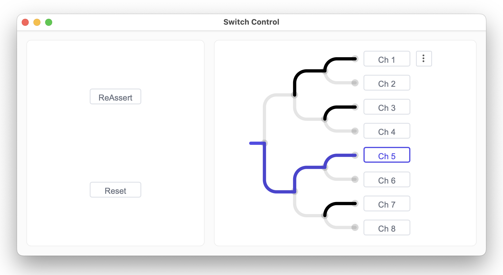
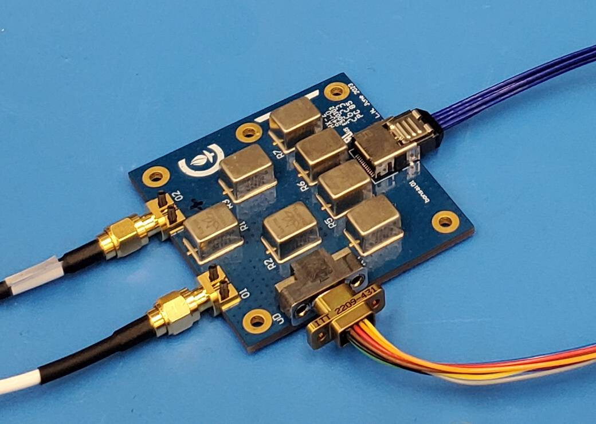

# Switch Control

A python program and webview-based user interface for controlling a cryogenic RF switch.

The python program sends serial commands to an 8 channel [numato relay board](https://numato.com/product/8-channel-usb-relay-module/). This, in turn, sends positive and negative voltage pulses to a binary tree of teledyne relays

The python program entrypoint is located in `backend/backend/main.py`. It is a fastapi webserver, with integrated `pywebview` for hosting the user interface. The UI is compiled from a svelte project in `/switch_control`.

Use `build_ui_and_run.sh` to compile the frontend user interface, copy it into the `/backend` directory, and start the python webserver using the `uv` python project manager.

Sometimes when editing the user interface, it's helpful to see changes to the code updated immediately in the UI. For this, use `dev_ui.sh`. This will run a vite devserver, and allow you to see the UI inside a browser tab as you edit and update its code.
