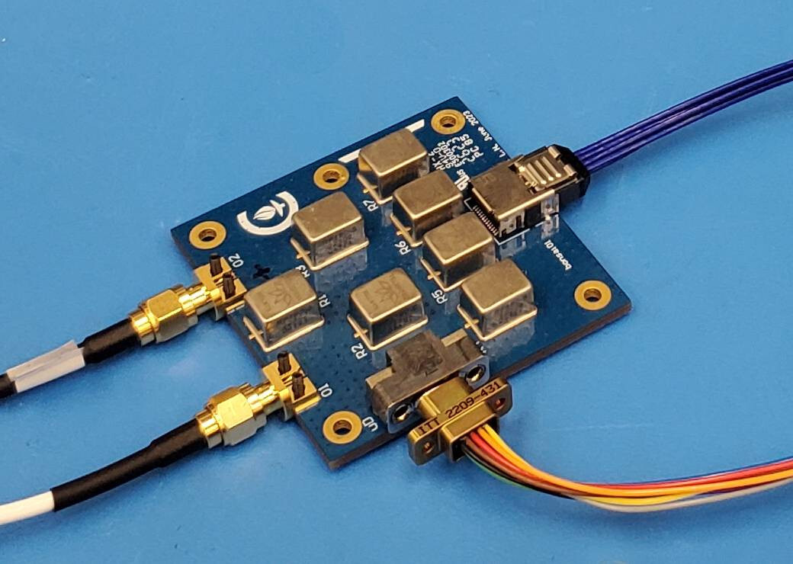

# Switch Control

📖 **Documentation: [switch.snsphd.online](https://switch.snsphd.online/)** — start with the [Quickstart](https://switch.snsphd.online/quickstart/).


A python program and webview-based user interface for controlling a cryogenic RF switch.

The python program sends serial commands to an 8 channel [numato relay board](https://numato.com/product/8-channel-usb-relay-module/). This, in turn, sends positive and negative voltage pulses to a binary tree of teledyne relays. This allows one pair of SMA inputs to be switched to 1 of 8 possible differential output pairs in a ARC6-8ch connector.



The Python entrypoint is `backend/backend/main.py`. It uses lab-link with a
Starlette server and an integrated `pywebview` window. The Svelte UI is built
from `/switch_control`.

The backend's `AppState` reactive model is the single live source of truth for
the relay tree, active channel, labels, settings, and pulse-generator status.
The browser receives snapshots and reactive JSON patches over lab-link's
WebSocket and sends hardware operations as lab-link commands. There are no
REST polling or server-sent-event state paths.

Remote access uses lab-link's persistent authorization workflow. On first run,
the host UI asks for a master passphrase and stores only its Argon2id hash in
`switch_control_auth.db`. The passphrase remains the manual recovery path
across restarts. A successful login creates an HttpOnly, SameSite browser
session; the login screen can remember a device for 30 days.

The Remote Access dialog issues single-use, five-minute invitation URLs for QR
codes and copyable links. The credential stays in the URL fragment, is removed
from browser history during exchange, and is never placed in shared reactive
state. Only its safe lifecycle status is synchronized, so consumed, expired,
or revoked links are disabled without polling. Unauthenticated WebSockets are
rejected before lab-link sends application state, and commands are authorized
server-side. `remote_access_passphrase` in `system_settings.yml` is retained
only to migrate an older fixed passphrase into a new auth database.

This is a trusted-LAN convenience gate, not encrypted transport. Use HTTPS or
a private overlay network when traffic confidentiality is required.

Use `build_ui_and_run.sh` to compile the frontend user interface, copy it into the `/backend` directory, and start the python webserver using the `uv` python project manager.

Sometimes when editing the user interface, it's helpful to see changes to the code updated immediately in the UI. For this, use `dev_ui.sh`. This will run a vite dev-server, and allow you to see the UI inside a browser tab as you edit and update its code.

## Installation

Clone the repo and run the setup script (macOS or Linux):

```bash
git clone https://github.com/sansseriff/switch_control.git
cd switch_control
bash setup.sh
```

See the [Quickstart guide](https://switch.snsphd.online/quickstart/) for the
full walkthrough, and [Hardware configuration](https://switch.snsphd.online/configuration/)
for setting up `system_settings.yml`.
