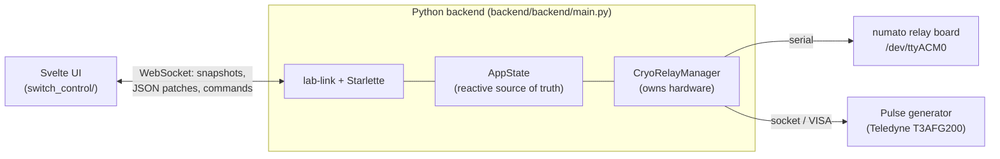

# Architecture

Switch Control is a Python backend that hosts both a web server and a native
desktop window, driving a Svelte UI over a reactive WebSocket connection.

## Components

## Backend

- **Entrypoint:** `backend/backend/main.py` — a [lab-link] application running
  on a [Starlette] server with an integrated [pywebview] window.
- **`AppState`** is the single live source of truth: the relay tree, active
  channel, button labels, settings, and pulse-generator status. The browser
  receives snapshots and reactive JSON patches over lab-link's WebSocket and
  sends hardware operations as lab-link **commands**. There is no REST polling
  and no server-sent-event state path.
- **`CryoRelayManager`** owns the hardware resources only (relay board, pulse
  controller, amp protector). Which pulse generator it uses is chosen at
  startup from [`system_settings.yml`](configuration.md).

## Frontend

The UI is a Svelte app in `switch_control/`, built with [Bun] and Vite. During
development, `dev_ui.sh` runs a Vite dev server with hot reload; for production,
`bun run buildall` compiles the app and copies it into the backend so the
Python process can serve it directly.

## Remote access

Remote access uses lab-link's persistent authorization workflow:

- On first run the host UI asks for a **master passphrase** and stores only its
  Argon2id hash in `switch_control_auth.db`. The passphrase is the manual
  recovery path across restarts.
- A successful login creates an HttpOnly, SameSite browser session; the login
  screen can remember a device for 30 days.
- The Remote Access dialog issues **single-use, five-minute** invitation URLs
  for QR codes and copyable links. The credential stays in the URL fragment, is
  removed from browser history during exchange, and is never placed in shared
  reactive state — only its safe lifecycle status (consumed / expired / revoked)
  is synchronized.
- Unauthenticated WebSockets are rejected before any application state is sent,
  and commands are authorized server-side.

!!! warning "Trusted-LAN gate, not encrypted transport"
    This is a convenience gate for a trusted network, not encrypted transport.
    Use HTTPS or a private overlay network when traffic confidentiality is
    required.

`remote_access_passphrase` in `system_settings.yml` is retained only to migrate
an older fixed passphrase into a new auth database.

[lab-link]: https://github.com/sansseriff
[Starlette]: https://www.starlette.io/
[pywebview]: https://pywebview.flowrl.com/
[Bun]: https://bun.sh/
