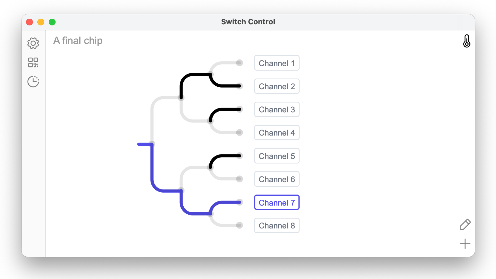

# Switch Control

A Python program and web UI for controlling a **cryogenic RF switch**.

The backend drives an 8-channel [numato USB relay
board](https://numato.com/product/8-channel-usb-relay-module/) over a serial
connection. The relay board routes positive and negative voltage pulses into a
binary tree of Teledyne latching relays, which switches one pair of SMA inputs
to **one of eight** differential output pairs on an ARC6-8ch connector.

The voltage pulses themselves are produced by a function generator — on this
lab's hardware, a **Teledyne T3AFG200** reached over a shared instrument
socket server. See [Hardware configuration](configuration.md) for how a given
machine selects its pulse generator.

## What's here

- :material-rocket-launch: **[Quickstart](quickstart.md)**
  Install dependencies, build the UI, and launch the app.

- :material-tune: **[Hardware configuration](configuration.md)**
  `system_settings.yml`, pulse-generator selection, and enabling hardware.

- :material-sitemap: **[Architecture](architecture.md)**
  The reactive lab-link backend, the Svelte UI, and remote access.

## At a glance

- **Backend entrypoint:** `backend/backend/main.py` — a [lab-link] +
  [Starlette] server hosting an integrated [pywebview] window.
- **Frontend:** a Svelte app in `switch_control/`, built with [Bun] and Vite.
- **State model:** the backend's reactive `AppState` is the single source of
  truth; the browser receives snapshots and JSON patches over a lab-link
  WebSocket and sends hardware operations as lab-link commands (no REST
  polling, no SSE).
- **Package management:** [uv] for Python, [Bun] for the web assets.

[lab-link]: https://github.com/sansseriff
[Starlette]: https://www.starlette.io/
[pywebview]: https://pywebview.flowrl.com/
[Bun]: https://bun.sh/
[uv]: https://docs.astral.sh/uv/
